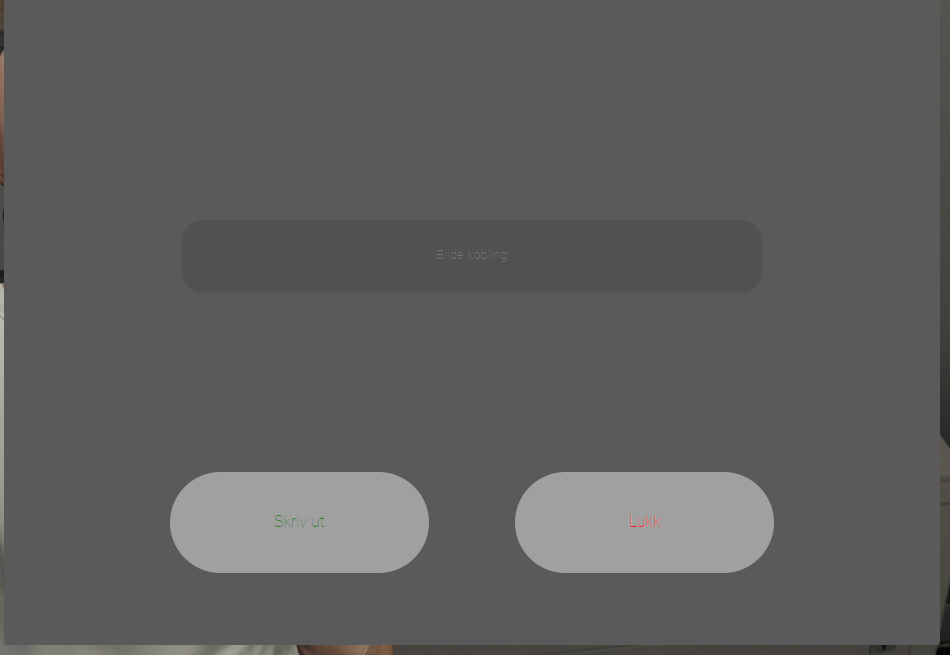
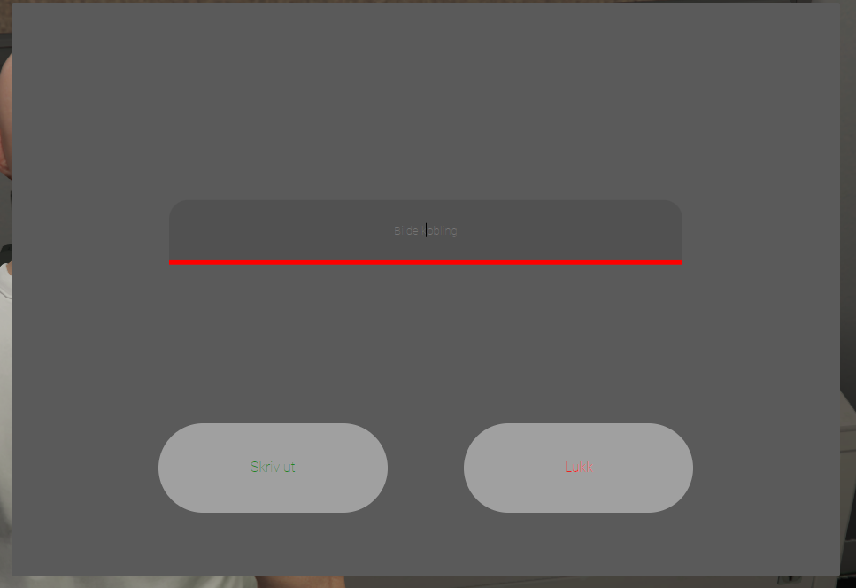
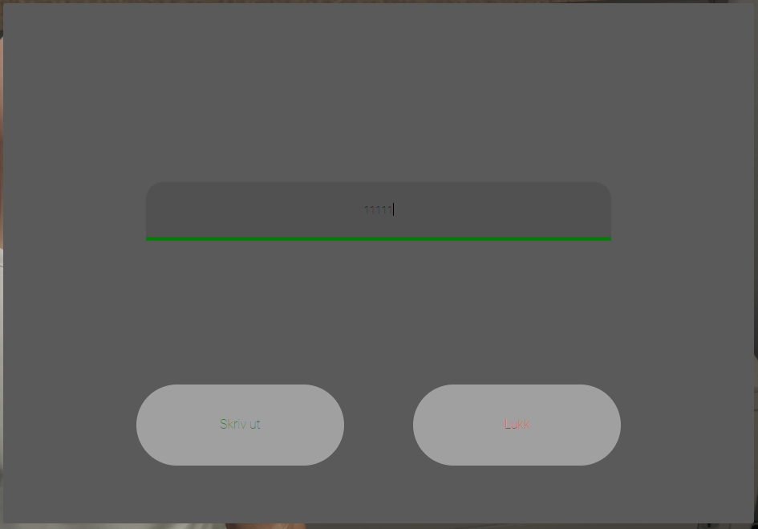

# qb-printer

```lua
    printerdocument              = { name = 'printerdocument', label = 'Dokument', weight = 500, type = 'item', image = 'printerdocument.png', unique = true, useable = true, shouldClose = true, combinable = nil, description = '' },

Standard: 



When in focus:


When input field has text in:
